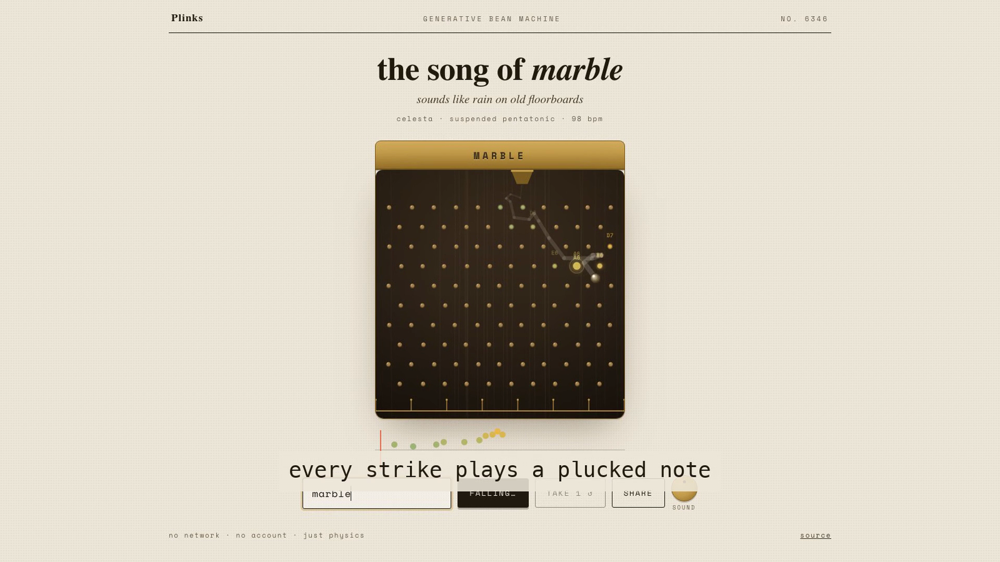

<p align="center">
  
</p>

# Plinks

**Type a word, drop a marble, and physics composes the song of that word.**

**Live → [play-plinks.vercel.app](https://play-plinks.vercel.app)** · [launch video](docs/launch.mp4)

## What it does

Every word is a different song. Type one, and a marble drops through a walnut
pegboard — a Galton bean machine — playing a plucked note each time it strikes a
peg. The struck pegs keep a pitch-colored ember, so the board remembers the
melody it just played. Landing in a basin resolves the song on a deep tonic.

The same word always produces the same song: the board, scale, instrument, tempo
and marble path are all derived deterministically from the word itself. `?take=N`
varies the drop without changing the song's identity.

- Type any word (or visit `/<word>` directly — the URL is the song)
- Another take re-drops the same seed with a different roll
- Tap any note on the score rail to hear it again — it flashes its peg on the board
- Share renders a 1200×630 card of the melody in the product's own language
- No network calls, no accounts, no AI — physics and synthesis only

## How it works

The word is normalized to a URL-safe slug, hashed (FNV-1a), and the hash seeds a
mulberry32 RNG that picks the instrument kit, scale, root note, BPM, board
geometry and even each peg's tangential "personality" kick. A fixed-timestep
(1/240s) marble simulation records every peg strike as a note event — pitch from
the peg's position on the scale, velocity from impact speed — plus a final tonic
when it settles in a basin.

Each note is synthesized on impact with Karplus-Strong plucked-string synthesis:
a seeded noise burst rings through a feedback delay line shaped per instrument
(kalimba, marimba, celesta), then passes through a generated exponential-decay
convolution reverb.

Interesting detail: the audio is scheduled at the physical collision time, not a
quantized grid — so what you see is literally what you hear. The same seed
replays the identical performance, which is what makes a shared URL reproduce
the song exactly.

## Run locally

```bash
npm install
npm run dev        # http://localhost:5173
npm run build      # tsc + vite production build
npx vitest run     # engine determinism tests
npm run lint       # oxlint
```

## Stack

Vite · React 19 · TypeScript · Canvas 2D · Web Audio API (Karplus-Strong +
convolution reverb) · zero runtime dependencies, fonts self-hosted via
@fontsource. Deployed on Vercel.

## License

MIT
